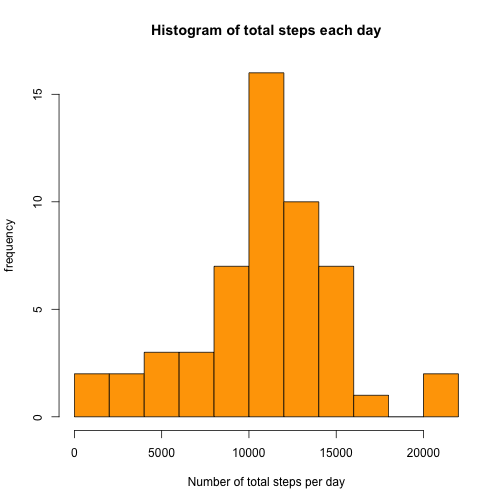
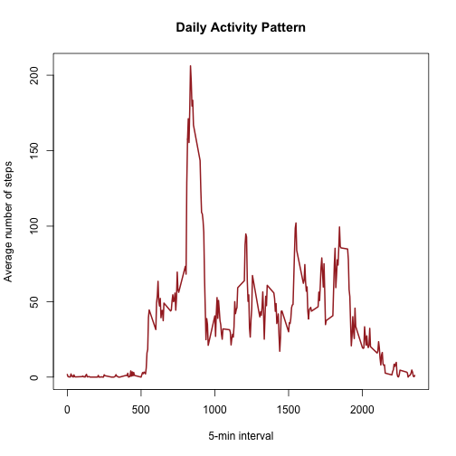
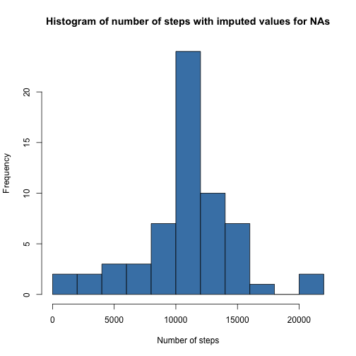
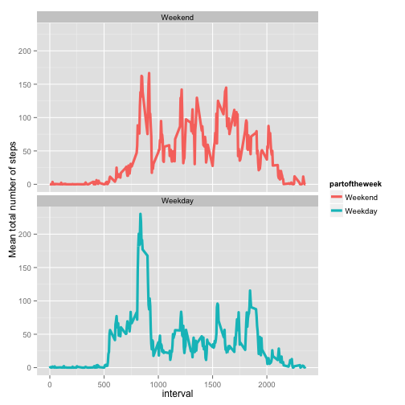

##Introduction#


This assignment makes use of data from a personal activity monitoring device. This device collects data at 5 minute intervals through out the day. The data consists of two months of data from an anonymous individual collected during the months of October and November, 2012 and include the number of steps taken in 5 minute intervals each day.

##Loading and preprocessing the data##


First we load the data. Afterwards, we check the structure of the data. We see that we need to change the column variable with the date that is not formatted as of class date.


```r
# load the data
act <- read.csv("activity.csv")

# make the necessary transformations in the data
str(act)
```

```
## 'data.frame':	17568 obs. of  3 variables:
##  $ steps   : int  NA NA NA NA NA NA NA NA NA NA ...
##  $ date    : Factor w/ 61 levels "2012-10-01","2012-10-02",..: 1 1 1 1 1 1 1 1 1 1 ...
##  $ interval: int  0 5 10 15 20 25 30 35 40 45 ...
```

We also confirm that there are missing values in the variable steps.


```r
sum(is.na(act$steps))
```

```
## [1] 2304
```

Now we will make the necessary transformations in the data, to have the column date of class Date.


```r
# make the necessary transformations in the data
act$date <- as.Date(act$date, "%Y-%m-%d")
```


For this part of the assignment, we will ignore the missing values in the dataset.

##What is mean total number of steps taken per day?##


We calculate the total number of steps taken per day.


```r
sum_steps_per_day <- aggregate(steps ~ date, act, sum, na.rm=TRUE)
```

Then make a histogram of the total number of steps taken each day.


```r
hist(sum_steps_per_day$steps, col = "orange", breaks = 10,
     xlab = "Number of total steps per day", ylab = "frequency", 
     main = "Histogram of total steps each day")
```

 

Next calculate and report the mean and the media of the total number of steps taken per day.
First the mean:


```r
mean(sum_steps_per_day$steps, na.rm = TRUE)
```

```
## [1] 10766.19
```

and then the median:


```r
median(sum_steps_per_day$steps, na.rm = TRUE)
```

```
## [1] 10765
```


##What is the average daily activity pattern?##


We make a time series plot (i.e. type = "l" ) of the 5-minute interval (x-axis) and the average number of steps taken, averaged across all days (y-axis).


```r
mean_steps_per_interval <- aggregate(steps ~ interval, act, mean, na.rm=TRUE)

plot(mean_steps_per_interval$interval, mean_steps_per_interval$steps, 
     type = "l", lwd = 2, col = "brown", xlab = "5-min interval",
     ylab = "Average number of steps", 
     main = "Daily Activity Pattern")
```

 


Which 5-minute interval, on average across all the days in the dataset, contains the maximum number of steps?


```r
# first we calculate the max number of steps
max_mean_steps <- max(mean_steps_per_interval$steps)
# And then we find the interval that has it
max_row <- subset(mean_steps_per_interval, steps == max_mean_steps)
# This is the interal we are looking for
max_row$interval
```

```
## [1] 835
```


##Imputing missing values##


There are a number of days/intervals where there are missing values (coded as NA ). The presence of missing days may introduce bias into some calculations or summaries of the data.

Let's again calculate and report the total number of missing values in the  dataset (i.e. the total number of rows with NA's):


```r
sum(is.na(act$steps))
```

```
## [1] 2304
```

Our strategy to replace the missing values is to use the mean number of steps for the 5- minute interval. We create a new dataset that is equal to the original dataset but with the missing data filled in.


```r
library(plyr)

impute.mean.steps <- function(x) replace(x, is.na(x), mean(x, na.rm = TRUE))
act2 <- ddply(act, ~ interval, transform, imputed_steps = impute.mean.steps(steps))

# reorder the new data set to be ordered as in the original by date
act2 <- act2[order(act2$date), ]
```

We make a histogram of the total number of steps taken each day with the new data set:


```r
total_steps_per_day_imputed <- aggregate(imputed_steps ~ date, act2, sum)

hist(total_steps_per_day_imputed$imputed_steps, col = "steelblue", breaks = 10,
     xlab = "Number of steps",
     ylab = "Frequency",
     main = "Histogram of number of steps with imputed values for NAs")
```

 

Next we calculate and report the mean of the total number of steps taken per day


```r
mean(total_steps_per_day_imputed$imputed_steps)
```

```
## [1] 10766.19
```

and the median of the total number of steps taken per day


```r
median(total_steps_per_day_imputed$imputed_steps)
```

```
## [1] 10766.19
```

Do these values differ from the estimates from the first part of the assignment? 
The values are very close, the mean is just the same and the median is just one unit more, as we can see above.

What is the impact of imputing missing data on the estimates of the total daily number of steps?
The distribution is nearly the same as we can see in the histogram.

##Are there differences in activity patterns between weekdays and weekends?##


We use the dataset with the filled-in missing values for this part. First we create a new factor variable in the dataset with two levels – “weekday” and “weekend” indicating whether a given date is a weekday or weekend day.


```r
act2$dayoftheweek <- weekdays(act2$date)

act2$partoftheweek <- ifelse(act2$dayoftheweek == "Saturday" |
                                 act2$dayoftheweek == "Sunday", 0, 1)

act2$partoftheweek <- factor(act2$partoftheweek, 
                                labels = c('Weekend', 'Weekday'))
```

Next we make a panel plot containing a time series plot (i.e. type = "l" ) of the 5-minute interval (x-axis) and the average number of steps taken, averaged across all weekday days or weekend days (y-axis). 


```r
library(ggplot2)

avg_steps_per_interval_over_weekparts <-
    ddply(act2, .(interval, partoftheweek), summarize,
          total_imputed_steps = mean(imputed_steps))

g <- ggplot(data = avg_steps_per_interval_over_weekparts,
            aes(x = interval, y = total_imputed_steps, col = partoftheweek)
            )
g <- g  + geom_line(size = 1.5) 
g <- g + ylab("Mean total number of steps") 
g <- g + facet_wrap(~ partoftheweek, ncol = 1, nrow=2)
g
```

 

####Conclusion####
We conclude that there are differences in activity patterns between weekdays and weekends. There is more activity earlier in the day during weekdays, but there is clearly more activity in the weekends overall.


